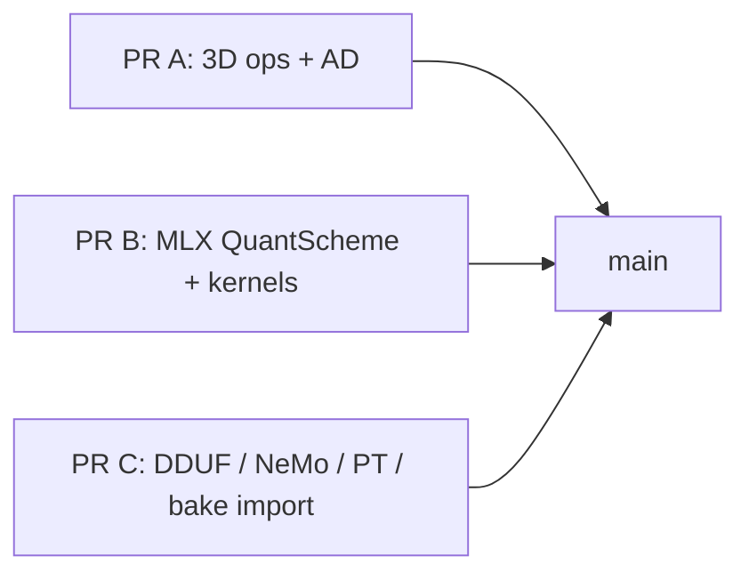

# WIP PR split plan (review items 1–12)

Uncommitted work on `main` spans three products. Split before merge:

## PR A — 3D ops + autodiff
- `rlx-ir`: `Interpolate3d`, `*3dBackward`
- `rlx-autodiff`: VJPs, decompose (`Conv3dBackward*`, `MaxPool3dBackward`)
- Backends: CPU/CUDA/Metal/wgpu/MLX/ROCm encode + kernels + parity tests
- Docs: `op-coverage.md` refresh

## PR B — MLX keep-packed DequantMatMul
- `QuantScheme::Mlx*`
- `rlx-mlx-io` (leaf) + CPU / gpu-host / Metal / CUDA / wgpu / Vulkan / QNN / CoreML
- Env: `RLX_MLX_DEQUANT_GPU_DISABLE`
- Docs: `mlx-weights.md`, `gguf-backend-paths.md`

## PR C — Package importers
- `rlx-dduf`, `from_dduf` / `from_mlx` / `from_nemo` / `from_pt`
- `rlx-bake` weights policy, `rlx-pkg` CLI
- Shape-preserving packing + streaming DDUF visit

**Note:** Do not open PRs until this plan is approved. Snapshot with `git stash create` first.
## License

MIT OR Apache-2.0.
