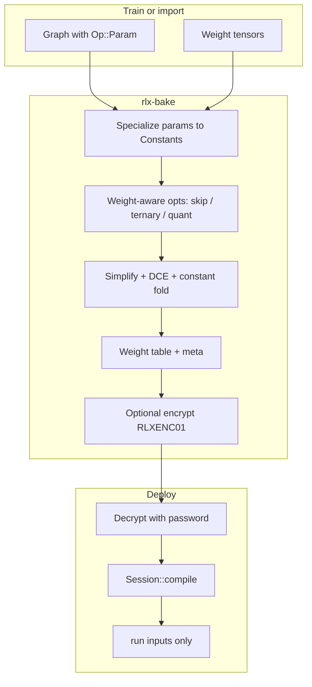

# rlx-bake — offline optimize, merge, and (optionally) encrypt

`rlx-bake` turns a **graph + known weights** into a single deployable `*.rlx`
file. That is not the same as zipping `model.json` next to `weights.safetensors`.

The bake pass **looks at weight values** and rewrites the graph when it can:

- fold weight-only math into constants
- skip work that multiplies by exact zeros
- pack exact ternary `{−1,0,+1}` weights as GGUF TQ2_0 and replace `MatMul`
  with `DequantMatMul` (add / sub / skip instead of dense f32 GEMM)
- optionally pack remaining dense weights as Q8_0 the same way

The result is **fewer bytes to load** and **less compute per forward**, with
weights already fused into the graph (no `set_param` at run time).

Related: [weight-compute-caching.md](weight-compute-caching.md) (compile-time
`param_bindings` and runtime hoist). Crate: [`crates/io/rlx-bake`](../crates/io/rlx-bake/).

---

## Mental model

| Approach | What you ship | At load / run |
|----------|---------------|---------------|
| Graph + sidecar weights | IR + full f32 (or raw) tensors | Load both; `set_param`; every `MatMul` is dense |
| **rlx-bake `*.rlx`** | One file: optimized MIR + weight table | Decrypt (if sealed) → `compile(graph)` → run; weights are already `Constant` / packed ops |



---

## What is inside a `*.rlx` file

### Plaintext (`RLXBAKE1`, schema v2)

| Field | Meaning |
|-------|---------|
| `graph` | Optimized MIR: params specialized; matmuls may be `DequantMatMul` |
| `weights` | Named table: shape, encoding (`f32` / `gguf_tq2_0` / `gguf_q8_0`), bytes |
| `meta` | I/O shapes, node counts, bake stats (skip / ternary / quant) |

Layout: 8-byte magic `RLXBAKE1` + `u32` version + bincode body.

### Ship format (`.rlxp`)

For mmap-friendly weights, sidecars, dist placement, and an optional executable
MIR graph, export to the **flat** package (default) — see [rlxp.md](rlxp.md).
ZIP / directory containers remain available for inspectability. Bake still
produces `RLXBAKE1`; convert or bake with `--format rlxp`:

```bash
rlx-bake graph.json -o model.rlxp --format rlxp --weights w.safetensors
rlx-bake convert model.rlx -o model.rlxp
# optional ONNX path (cargo feature `onnx`):
rlx-bake --features onnx -- import-onnx model.onnx -o model.rlxp
```

`RLXENC01` encryption stays on the bake blob path. Optional `RLXSEAL1` seals for
cold/sidecar blobs are on `rlx-pkg` (`encrypt` feature).

### Encrypted (`RLXENC01`, cargo feature `encrypt`)

The **entire** plaintext blob is sealed with ChaCha20-Poly1305; the key is
Argon2id-derived from a password (random salt + nonce per file).

`read_rlx` refuses encrypted files so a password cannot be skipped by accident.
Use `read_rlx_with_password` or the CLI `decrypt` subcommand.

---

## Bake pipeline (what each step does)

1. **Specialize** — each bound `Op::Param` becomes a named `Op::Constant`
2. **skip** — `MatMul(x, 0)` → zero constant (no GEMM)
3. **ternary** — exact `{−1,0,+1}` matmul weights → TQ2_0 bytes + `DequantMatMul`
   (weights stored in BT `[N,K]` layout for the CPU GGUF path)
4. **quant** (opt-in) — remaining f32 matmul weights → Q8_0 + `DequantMatMul`
5. **unfold** — list surviving weight tensors in the weight table
6. **Algebraic simplify → DCE → constant fold** — remove dead / foldable nodes

### Optimization profiles (`--opt` / `BakeProfile`)

Pick a profile for the common trade-offs, then override individual passes if needed.

| Profile | Intent | skip | ternary | Q8 | cleanup (simplify / DCE / fold) |
|---------|--------|------|---------|----|----------------------------------|
| `merge` | One file, same dense MatMul compute | no | no | no | no |
| `fold` | Fold weight-only math; keep dense GEMM | no | no | no | yes |
| `exact` | Default — lossless value rewrites | yes | yes | no | yes |
| `size` | Smaller payload (Q8 may change numerics) | yes | yes | yes | yes |

Aliases: `none`/`raw` → `merge`; `cleanup` → `fold`; `lossless`/`default`/`compute` → `exact`; `compact`/`quant` → `size`.

### Memory / loading (`--memory` / `MemoryMode`)

Weight bytes used to live **twice** (graph `Constant` + weight table). Pick where
they live after bake:

| Mode | On disk | Before `Session::compile` |
|------|---------|---------------------------|
| `duplex` | Graph **and** table (legacy) | Use `file.graph` as-is |
| `runtime` | Graph only; table is metadata | Use `file.graph` as-is |
| `compact` | Table only; graph Constants emptied | Call `file.materialize_weights()` or `file.into_runtime_graph()` |

`exact` / `fold` / `size` default to **`compact`** + constant dedupe + drop
folded-away bindings. `merge` stays **`duplex`**.

Also:

- `--dedupe-constants` / `--no-dedupe-constants` — CSE identical `Constant` nodes
- `--keep-folded-bindings` / `--no-folded-bindings` — keep or drop source params that folded away
- feature `mmap` — `read_rlx_mmap` avoids an extra full-file `Vec` copy on plaintext load

```bash
cargo run -p rlx-bake -- bundle -o model.rlx --opt size --memory compact
cargo run -p rlx-bake -- bundle -o model.rlx --memory runtime   # compile graph directly
cargo run -p rlx-bake -- bundle -o model.rlx --memory duplex    # inspect + run without materialize
```

```rust
let (mut file, report) = bake(&graph, &bindings, &BakeProfile::Size.options());
assert!(report.memory.graph_bytes_stripped > 0 || !file.needs_materialize());
let graph = file.into_runtime_graph()?; // materialize if compact
session.compile(graph);
```

Fine flags (applied **after** `--opt`): `--skip` / `--no-skip`, `--ternary` / `--no-ternary`, `--quant` / `--no-quant`, `--unfold` / `--no-unfold`, `--fold` / `--no-fold`, `--dce` / `--no-dce`, `--simplify` / `--no-simplify`, `--no-cleanup` (turns off simplify+DCE+fold).

```bash
# Package only (no packing)
cargo run -p rlx-bake -- bundle -o model.rlx --opt merge

# Lossless skip + ternary (default; same as --opt exact)
cargo run -p rlx-bake -- bundle -o model.rlx

# Smaller file
cargo run -p rlx-bake -- bundle -o model.rlx --opt size

# Size profile but keep dense f32 for non-ternary weights
cargo run -p rlx-bake -- bundle -o model.rlx --opt size --no-quant
```

```rust
use rlx_bake::{BakeOptions, BakeProfile, bake};

let (file, report) = bake(&graph, &bindings, &BakeProfile::Exact.options());

// Prefer smaller weights; override one pass:
let mut opts = BakeOptions::from_profile(BakeProfile::Size);
opts.ternary = false; // force Q8 on what would have been TQ2
let (file, report) = bake(&graph, &bindings, &opts);
```

---

## End-to-end example: MNIST train → bake → encrypt → run

Two examples under `crates/io/rlx-bake/examples/` walk the full story:

| Example | Role |
|---------|------|
| `mnist_train_bake` | Train a tiny MLP, ternarize / fine-tune, bake + encrypt |
| `mnist_run_encrypted` | Load with `RLX_BAKE_PASSWORD`, compile, infer |

Shared helpers: `examples/common/mnist.rs`.

### Prerequisites

- Workspace build with features `encrypt` and `runtime`
- Password in the environment (both steps use the same variable)
- Optional: real MNIST IDX files (otherwise synthetic data is used)

```bash
# Optional: point at torchvision-style raw MNIST
# export RLX_MNIST_DIR=~/.cache/torchvision-mnist/MNIST/raw

export RLX_BAKE_PASSWORD='demo-secret'
```

### Step 1 — Train and bake (producer)

```bash
cargo run -p rlx-bake --example mnist_train_bake --features encrypt,runtime --release
```

What this example does, in order:

1. **Load data** — up to 8192 MNIST train images from `RLX_MNIST_DIR` or
   `~/.cache/torchvision-mnist/MNIST/raw`; if missing, synthetic class-conditional
   blobs (same shapes).
2. **Train** — host SGD on MLP `784 → 64 → 10` (ReLU), several epochs.
3. **Ternarize `w1`** — map weights to exact `{−1,0,+1}` (BitNet-style), then
   fine-tune biases / `w2` with `w1` frozen so accuracy recovers.
4. **Build inference graph** — `Op::Param` for `w1,b1,w2,b2`, `MatMul` + bias + ReLU.
5. **`bake(...)`** with skip + ternary + quant + unfold.
6. **`write_rlx_encrypted`** — seal the artifact; path defaults to
   `crates/io/rlx-bake/examples/out/mnist.rlx` (override with `RLX_BAKE_OUT`).

#### How to read the bake summary

Typical release run on real MNIST (numbers vary slightly):

```text
── bake optimization (not just model+weights) ──
  graph nodes:     10 → 10
  weight table:    4 tensors, ~14 KB (was ~204 KB raw f32)
  ternary packed:  1          # w1 → gguf_tq2_0 + DequantMatMul
  quant packed:    1          # w2 → gguf_q8_0  + DequantMatMul
    • w1  gguf_tq2_0  shape=[784, 64]  ~13 KB
    • w2  gguf_q8_0   shape=[64, 10]   ~0.7 KB
    • b1 / b2         f32 biases
```

Interpretation:

- **~15× fewer weight bytes** than raw f32 for this MLP — less I/O and memory at load.
- **`w1` is no longer a dense f32 `MatMul`** — ternary `DequantMatMul` (packed trits).
- **`w2` is Q8_0-packed** — same idea for the classifier head.
- Biases stay small f32 constants (not worth packing).
- The file on disk is **encrypted** (~29 KB for this model), magic `RLXENC01`.

That is the core lesson: bake produces an **already optimized** deployable unit,
not an archive of an unoptimized graph plus a full-precision weight dump.

### Step 2 — Run encrypted inference (consumer)

Use the **same** password. Do not pass it on the CLI — only the env var:

```bash
export RLX_BAKE_PASSWORD='demo-secret'
cargo run -p rlx-bake --example mnist_run_encrypted --features encrypt,runtime --release
```

What this example does:

1. Read `RLX_BAKE_PASSWORD` and the artifact path (`RLX_BAKE_OUT` or default).
2. Confirm magic `RLXENC01`.
3. `read_rlx_with_password` → decrypt → parse `RlxFile`.
4. Print weight encodings and bake stats from `meta`.
5. `Session::new(Device::Cpu).compile(file.graph)` — **no `set_param`**.
6. Run a batch of 32 images; print how many logits match labels.

Expected: compile succeeds without a weights sidecar; batch accuracy is high when
the train step used real MNIST (often 32/32 on the first train batch in the demo).

### Environment variables

| Variable | Used by | Meaning |
|----------|---------|---------|
| `RLX_BAKE_PASSWORD` | train + run | Encryption password (required) |
| `RLX_BAKE_OUT` | train + run | Output / input path for `*.rlx` |
| `RLX_MNIST_DIR` | train (optional) | Directory with IDX `train-images-idx3-ubyte` / `train-labels-idx1-ubyte` |

---

## Library usage (same ideas, no examples)

```rust
use std::collections::HashMap;
use rlx_bake::{BakeProfile, bake, write_rlx, write_rlx_encrypted, read_rlx_with_password};

let opts = BakeProfile::Size.options(); // skip + ternary + Q8 + cleanup
let (file, report) = bake(&graph, &bindings, &opts);
eprintln!(
    "nodes {}→{}  weights={}B  ternary={} quant={}",
    report.nodes_before,
    report.nodes_after,
    report.weight_bytes,
    report.optimize.ternary_packed,
    report.optimize.quant_packed
);

write_rlx("model.rlx", &file)?;                         // plaintext
write_rlx_encrypted("model.enc.rlx", &file, &password)?; // needs feature encrypt

let file = read_rlx_with_password("model.enc.rlx", &password)?;
let mut compiled = rlx_runtime::Session::new(rlx_runtime::Device::Cpu).compile(file.graph);
let outs = compiled.run(&[("x", &x)]);
```

---

## CLI (graphs / bundles you already have)

If you already have a torch-import **bundle** or MIR/HIR JSON + safetensors:

```bash
# Plaintext bake (default exact profile)
cargo run -p rlx-bake -- path/to/bundle -o model.rlx

# Smaller artifact
cargo run -p rlx-bake -- path/to/bundle -o model.rlx --opt size

# Encrypted bake
cargo run -p rlx-bake --features encrypt -- path/to/bundle -o model.rlx \
  --password-env RLX_BAKE_PASSWORD --opt size

# Decrypt to plaintext *.rlx
cargo run -p rlx-bake --features encrypt -- decrypt model.rlx -o model.plain.rlx \
  --password-env RLX_BAKE_PASSWORD
```

Inputs accepted: MIR `Graph` JSON, HIR `model.hir.json`, or a bundle directory
(`model.hir.json` + `weights.safetensors`).

---

## Cargo features

| Feature | Pulls in | Enables |
|---------|----------|---------|
| *(none)* | IR + compile only | Plaintext bake / `write_rlx` / `read_rlx` |
| `encrypt` | ChaCha20-Poly1305, Argon2id | `write_rlx_encrypted`, `read_rlx_with_password`, CLI `--password` / `decrypt` |
| `mmap` | memmap2 | `read_rlx_mmap` (plaintext; skips extra full-file copy) |
| `runtime` | `rlx-runtime` | MNIST examples that `Session::compile` / `run` |

MNIST examples require **both** `encrypt` and `runtime`.

---

## Source map

| Path | Role |
|------|------|
| [`crates/io/rlx-bake/src/lib.rs`](../crates/io/rlx-bake/src/lib.rs) | `bake`, `BakeOptions`, `BakeReport` |
| [`crates/io/rlx-bake/src/profile.rs`](../crates/io/rlx-bake/src/profile.rs) | `BakeProfile` (`merge` / `fold` / `exact` / `size`) |
| [`crates/io/rlx-bake/src/memory.rs`](../crates/io/rlx-bake/src/memory.rs) | `MemoryMode`, materialize / strip / constant CSE |
| [`crates/io/rlx-bake/src/optimize.rs`](../crates/io/rlx-bake/src/optimize.rs) | skip / ternary / quant / unfold |
| [`crates/io/rlx-bake/src/format.rs`](../crates/io/rlx-bake/src/format.rs) | `*.rlx` read/write |
| [`crates/io/rlx-bake/src/crypto.rs`](../crates/io/rlx-bake/src/crypto.rs) | encrypt feature |
| [`crates/io/rlx-bake/examples/mnist_train_bake.rs`](../crates/io/rlx-bake/examples/mnist_train_bake.rs) | train → bake → encrypt |
| [`crates/io/rlx-bake/examples/mnist_run_encrypted.rs`](../crates/io/rlx-bake/examples/mnist_run_encrypted.rs) | env password → run |
| [`crates/io/rlx-bake/examples/common/mnist.rs`](../crates/io/rlx-bake/examples/common/mnist.rs) | MLP graph, SGD, ternarize, MNIST I/O |

---

## Takeaway

**rlx-bake** is the offline path from “trainable / importable graph + weights” to
a **sealed, weight-aware optimized artifact**. The MNIST pair of examples is the
shortest way to see every stage: train → value-based packing → smaller payload →
encrypt → decrypt via env → compile and run with no weight sidecar.
