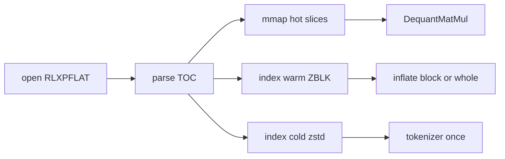

# RLX Package Format (`.rlxp`)

Single-file **flat mmap** package (default), with optional ZIP or directory
layouts for inspectability / editing. Supports a **hybrid hot / warm / cold**
data plane: mmap active weights, block-zstd for rarely used tensors, whole-blob
zstd for sidecars.

Bake’s `RLXBAKE1` (`*.rlx`) remains supported; export into `.rlxp` for deployment.

Crate: [`crates/io/rlx-pkg`](../crates/io/rlx-pkg/).

## Why flat beats the alternatives

| Format | Load | Size (quantized LLM) | Notes |
|--------|------|----------------------|--------|
| **RLXP flat** | One `mmap`, tiny JSON TOC | GGUF-class packed weights, **no duplex**, no ZIP headers | MIR + hybrid cold/warm |
| GGUF | One `mmap` | Excellent packed quants | Weights + metadata; no portable MIR graph |
| safetensors | One `mmap` | Usually f16/bf16/f32 | No GGUF-class block quants |
| DDUF | ZIP + member seek | safetensors + ZIP overhead | Import via `rlx-pkg import-dduf` / [`docs/dduf.md`](dduf.md) |
| MLX | dir / safetensors / npz | Dense + affine/mxfp packs | Import via `rlx-pkg import-mlx` / [`docs/mlx-weights.md`](mlx-weights.md) |
| NeMo | `.nemo` tar + torch ckpt | Dense f32 | `rlx-pkg import-nemo` |
| PyTorch | `.pt` / `.pth` / `bin` | Dense f32 | `rlx-pkg import-pt` |
| ONNX | Protobuf parse | Often dense floats + graph | Graph-heavy; not mmap-first for weights |

## Hybrid tiers

| Tier | Codec | Access API | Use for |
|------|-------|------------|---------|
| **Hot** | `none` (raw) | `tensor_mmap` / `tensor_bytes` | Active GEMM / dequant weights, graph, placement |
| **Warm** | `zstd_blocks` (`ZBLK` header + per-block zstd) | `tensor_bytes`, `tensor_warm_block(i)` | Idle experts, other-rank shards, large rarely touched blobs |
| **Cold** | `zstd` (one frame) | `sidecar` / decode on read | Tokenizer, chat template, license, bake report |



Default write policy for flat packs:

- Weights default **hot** (set `PackedWeight.tier`, or `apply_auto_tier`)
- Sidecars **cold zstd** (`WriteOptions.compress_sidecars`, default true)
- Graph + placement stay **hot/raw** (unless `include_graph = false`)
- Warm block size default **1 MiB** (`warm_block_size`)
- xxh3 checksums on by default (`write_checksums`); string interning on by default

Warm on-disk blob (`ZBLK`):

```
magic "ZBLK"
u32 block_size
u64 raw_length
u32 n_blocks
repeat n_blocks:
  u32 comp_len
  [comp_len bytes of one zstd frame]
```

## Containers

| Kind | When | Magic / shape |
|------|------|----------------|
| **Flat** (default `.rlxp`) | Ship / serve | `RLXPFLAT` + TOC + 64-byte-aligned data |
| **ZIP** (`.zip` or `--container zip`) | Human inspect (`unzip -l`) | ZIP64 STORE; **hybrid codecs supported** in shard bytes |
| **Dir** | Dev edit | Tree with `rlx.json`; hybrid codecs in shard |

### Flat layout

```
[0..8)   magic "RLXPFLAT"
[8..12)  container_version u32 LE (=2 for hybrid)
[12..16) flags u32 LE (bit0 = FLAG_HYBRID, bit1 = FLAG_BINCODE_TOC)
[16..24) toc_len u64 LE
[24..24+toc_len)  JSON or bincode FlatToc
[pad to 64-byte alignment]
[data)   graph | tensors | sidecars | placement
```

Each TOC tensor/sidecar row includes `tier`, `codec`, `offset`, `length`,
optional `raw_length`, and optional xxh3 `checksum`. Weight bytes appear
**once**; graph `Constant` payloads are cleared on write and filled on
`Package::graph()` (**hot tier only** by default — warm/cold bind via
`bind_tensor` / `bind_warm_and_cold`).

Optional TOC features:

- **String table** (`strings` + `name_i`) — `WriteOptions.intern_strings`
- **Bincode TOC** — `WriteOptions.bincode_toc` + `FLAG_BINCODE_TOC`
- **Weight-only** — `include_graph = false` → `graph.encoding = "none"`

## Warm is not a quant

Warm `zstd_blocks` shrinks **rarely touched host blobs**. It does **not**
replace GGUF-class block quants (`Q4_K`, …). For LLM weights, pack as
`gguf_q4_k` (or similar) on the **hot** tier; use warm for idle experts /
other-rank shards / large spare tensors. Compare size against GGUF with
the `q4k_compare` bench — not against warm zstd of f32.

## Compat policy

| Field | Rule |
|-------|------|
| `format` | Must be `"rlxp"` |
| `format_version` | Loader rejects if newer than crate `FORMAT_VERSION` |
| `compat_version` | Package may require up to crate `COMPAT_VERSION` |
| `features` | Advisory + capability gates (`hybrid_storage`, `toc_bincode`, …) |
| `FLAT_CONTAINER_VERSION` | v1 packs load (tiers default hot/none); v2 = hybrid |
| `graph.encoding` | `bincode_graph_v1` or `none` (weight-only) |

Readers must ignore unknown TOC fields (serde `deny_unknown_fields` is
**not** used). Writers should bump `compat_version` only when old loaders
cannot safely skip new required behavior.

## Executable graph (optional)

Like ONNX, an `.rlxp` **may** embed a runnable MIR graph (`graph.encoding =
bincode_graph_v1`). That is the bake / ONNX-import default. Weight-only packs
set `WriteOptions.include_graph = false` (`encoding = "none"`) — valid for
GGUF-style weight archives.

```bash
# optional cargo feature on rlx-bake
cargo run -p rlx-bake --features onnx -- import-onnx model.onnx -o model.rlxp
cargo run -p rlx-bake --features onnx -- import-onnx model.onnx -o weights.rlxp --no-graph
```

Load + run when a graph is present:

```rust
let g = rlx_runtime::pkg::compile_rlxp(&session, "model.rlxp")?;
```

## CLI / Python / remote

```bash
rlx-pkg inspect model.rlxp
rlx-pkg verify model.rlxp
rlx-pkg tier model.rlxp -o out.rlxp --warm expert --hot tok_embd
rlx-pkg import-gguf model.gguf -o model.rlxp --no-graph
rlx-pkg convert in.zip -o out.rlxp --container flat
```

```python
import pyrlx
pyrlx.load_rlxp("model.rlxp")
pyrlx.convert_gguf_to_rlxp("m.gguf", "m.rlxp", include_graph=False)
```

Cargo features:

- `rlx-bake` / `onnx` — `onnx_to_rlxp` / `import-onnx` (optional executable MIR graph)
- `rlx-pkg` / `encrypt` — `seal_bytes` / `unseal_bytes` (`RLXSEAL1`)
- `rlx-pkg` / `remote` — HTTP Range TOC + on-demand tensor fetch (`RemoteFlat`)

## Versioning

1. **`format_version`** in manifest — structural package schema.
2. **`compat_version`** — minimum loader.
3. **`features`** — `hybrid_storage`, `zstd_cold`, `zstd_blocks_warm`, `weight_only`, …
4. **`FLAT_CONTAINER_VERSION`** (=2) — flat header; v1 packs still load.

## Benches

```bash
just throttle
RLX_ALLOW_THROTTLE=1 cargo run -p rlx-pkg --example bench_hybrid --release
RLX_ALLOW_THROTTLE=1 cargo run -p rlx-pkg --example bench_compare --release
RLX_ALLOW_THROTTLE=1 cargo bench -p rlx-pkg --bench hybrid_load --bench q4k_compare
# MNIST MLP bake → RLXP open/compile/run:
RLX_ALLOW_THROTTLE=1 cargo run -p rlx-bake --example mnist_bench_rlxp --features runtime --release
```

## Migration

```bash
rlx-bake graph.json -o model.rlxp --weights w.safetensors          # flat + cold sidecars
rlx-bake graph.json -o model.zip --format rlxp --container zip
rlx-bake convert model.rlx -o model.rlxp
```

`RLXENC01` stays on bake `.rlx`. Optional `RLXSEAL1` seals are available
behind the `encrypt` feature for cold/sidecar blobs.
