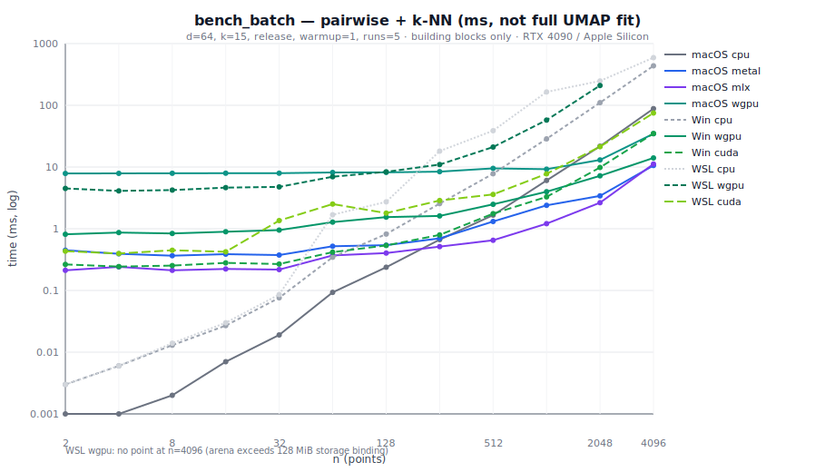

# rlx-umap

RLX implementation path for [parametric UMAP](https://github.com/eugenehp/fast-umap) (fast-umap).

## Scope

| Layer | Feature | What it covers |
|-------|---------|----------------|
| **Building blocks** | `cpu`, `graph`, `bench` | Cosine/Euclidean pairwise `[n,n]`, `umap.knn`, graph helpers, multi-backend parity |
| **Full parametric UMAP** | `full` (default) | [`Umap::fit`](src/umap.rs), [`FittedUmap::transform`](src/fitted.rs), sparse cross-entropy + Adam, MLP encoder, weight save/load — port of [fast-umap](https://github.com/eugenehp/fast-umap) training loop on RLX Session |

**Benchmarks (`bench_knn`, `bench_batch`) still time only the building-block path** (pairwise + k-NN), not `Umap::fit`. Use `umap_demo` or tests for full fit smoke checks.

### Full UMAP quick start

```sh
cargo run -p rlx-umap --release --example umap_demo --features full

# CLI training runner (RLX autodiff only — no Burn)
cargo run -p rlx-umap --release --bin train-umap --features full -- \
  --synthetic --n 1000 --epochs 50 --save /tmp/model.ruama

# MNIST → 2-D embedding (downloads data, writes SVG + CSV)
cargo run -p rlx-umap --release --example mnist_embedding --features full
cargo run -p rlx-umap --release --example mnist_embedding --features full -- \
  --n 10000 --epochs 150 --out docs/mnist_embedding.svg --csv docs/mnist_embedding.csv
```

```rust
use rlx_umap::prelude::*;

rlx_umap::register();
let config = UmapConfig::default();
let fitted = Umap::new(config).fit(data);
let mut fitted = Umap::new(config).fit(data);
let out = fitted.transform(new_points); // uses training z-score stats
```

`fit_with_progress` reports [`EpochProgress`](src/train.rs) every few epochs.

Library training entry points (same loop as `Umap::fit`, RLX `grad_with_loss` + host Adam):

- [`training::fit`](src/training.rs) / [`fit_with_progress`](src/training.rs)
- [`training::train_only`](src/training.rs) — weights + compiled graphs, no `FittedUmap` wrapper
- [`train-umap`](src/bin/train_umap.rs) binary — CSV / f64 matrix / `--synthetic` data

### Save / load

Weights and full models use **[safetensors](https://huggingface.co/docs/safetensors)** (`.safetensors`, default) or **GGUF F32** (`.gguf`). Legacy `.ruama` archives still load.

| API | Format (by file extension) |
|-----|----------------------------|
| [`FittedUmap::save`](src/fitted.rs) | `.safetensors` or `.gguf` — weights + `rlx_umap.*` metadata + norm stats + `UmapConfig` |
| [`FittedUmap::load`](src/fitted.rs) | Auto-detect; config embedded in metadata |
| [`FittedUmap::save_weights`](src/fitted.rs) | Weights + shapes in metadata |
| [`WeightStore::load`](src/weights.rs) | safetensors / GGUF / `.ruama` |

```rust
use rlx_umap::prelude::*;

fitted.save("/tmp/my_umap.safetensors")?;
fitted.save("/tmp/my_umap.gguf")?;  // F32 GGUF (feature `io-gguf`)
let mut loaded = FittedUmap::load("/tmp/my_umap.safetensors", Device::Cpu)?;
```

Training: global k-NN on the **training device** (fused `pairwise → umap.knn` on CPU/Metal/wgpu/**CUDA** — CUDA runs k-NN via GPU pairwise + host `umap.knn` inside `Op::Custom`; **MLX**: GPU pairwise + CPU `umap.knn`; NN-Descent for `n ≥ 10_000` with `nn-descent`) → fixed-size edge batches → RLX `grad_with_loss` backward → host Adam. **wgpu/CUDA** rewrite non-last-axis `Reduce` (e.g. PCA MSE) and unsupported backward ops (via shared `LowerBackwardOps`). Optional PCA warm-start (`pca` feature, on by default).

For GPU UMAP fit, enable the matching backend feature and device, e.g. `full,metal` + `Device::Metal`, `full,mlx` + `Device::Mlx` (macOS), `full,gpu` + `Device::Gpu`, or `full,cuda` + `Device::Cuda`.

```sh
# Full fit benchmark (not pairwise/k-NN only)
cargo run -p rlx-umap --release --example bench_umap --features full -- --n 256 --epochs 50
cargo run -p rlx-umap --release --example bench_umap --features full,metal -- --device metal
cargo run -p rlx-umap --release --example bench_umap --features full,mlx -- --device mlx
cargo run -p rlx-umap --release --example bench_umap --features full,gpu -- --device gpu
cargo run -p rlx-umap --release --example bench_umap --features full,cuda -- --device cuda
```

Disable extras: `cargo build -p rlx-umap --no-default-features --features full,cpu,graph,bench` (turns off `pca` / `nn-descent`).

## Ops

| Name | Inputs | Output | Description |
|------|--------|--------|-------------|
| `umap.knn` | `pairwise [n, n]` f32 | `packed [n, 2k]` f32 | Per-row k smallest distances (skip self). Columns `0..k` = neighbour indices (f32-encoded), `k..2k` = distances. |
| `umap.knn_backward` | `pairwise [n, n]`, `d_dist [n, k]` | `d_pairwise [n, n]` | Scatter distance gradients to selected matrix entries (feature `autodiff`). |

Graph builders (no custom op): `pairwise_cosine_graph`, `pairwise_euclidean_graph`, `cosine_knn_graph`.

## Benchmarks

Cosine distance `1 - cos(θ)` plus k-NN. Reference on host: `cosine_pairwise_reference` + `knn_forward_packed`.

### `bench_knn` — parity + speed (single `n`)

```sh
cargo run -p rlx-umap --release --example bench_knn
cargo run -p rlx-umap --release --example bench_knn --features metal,mlx,gpu
cargo run -p rlx-umap --release --example bench_knn --features all-backends

# e.g. cargo run -p rlx-umap --release --example bench_knn -- --n 512 --d 64 --k 15 --runs 10
```

| Section | Metrics |
|---------|---------|
| **Parity** | Pairwise max abs err vs reference; k-NN **index match rate**, mean dist err, distance histogram L1 |
| **Speed** | Median pairwise / knn / e2e ms per backend |

**Parity (typical, n=128, d=32, k=8, macOS):**

| backend | pairwise max err | index match |
|---------|------------------|-------------|
| cpu | ~2×10⁻⁷ | 1.0000 |
| metal | ~3×10⁻⁷ | 1.0000 |
| mlx | ~2×10⁻⁷ | 1.0000 |
| wgpu | ~3×10⁻⁷ | 1.0000 |

Integration tests: `tests/cosine_parity.rs`, `tests/backend_parity.rs` (enable `metal`, `mlx`, `gpu` features).

### `bench_batch` — timing vs batch size (`n` = number of points)

Sweeps **batch size** `n` (not a separate batch dim). Compiles once per `(backend, n)`, then times runs only.

```sh
cargo run -p rlx-umap --release --example bench_batch --features metal,mlx,gpu

# Default sizes: powers of 2 from 1 to 4096 → 1, 2, 4, …, 4096
cargo run -p rlx-umap --release --example bench_batch --features metal,mlx,gpu \
  -- --runs 5 --warmup 1

# Every n from 1 to 4096 (slow) + CSV for plotting
cargo run -p rlx-umap --release --example bench_batch --features metal,mlx,gpu \
  -- --batch-min 1 --batch-max 4096 --batch-step 1 --csv /tmp/umap_batch.csv

# Custom sizes
cargo run -p rlx-umap --release --example bench_batch -- \
  --batch-sizes 64,128,256,512,1024 --d 64 --k 15
```

| Flag | Default | Meaning |
|------|---------|---------|
| `--batch-min` / `--batch-max` | `1` / `4096` | Range (with power-of-2 steps if `--batch-step` unset) |
| `--batch-step` | (off) | Linear step, e.g. `1` → every integer in range |
| `--batch-sizes` | — | Comma list overrides range |
| `--d` | `64` | Embedding dimension |
| `--k` | `15` | Neighbours (`min(k, n-1)` when `n ≥ 2`) |
| `--warmup` / `--runs` | `1` / `5` | Timing repeats |
| `--csv` | — | Write `n,k,d,backend,pairwise_ms,knn_ms,e2e_ms,status` |

`n=1` skips k-NN (`k < n`). Output: markdown tables (e2e + pairwise ms) and optional CSV.

#### Results chart (May 2026) — building blocks only

**Not full UMAP** — cosine pairwise matrix + k-NN per row (same subgraph fast-umap uses for global k-NN, not the neural `fit()` loop).

Timing vs `n` (powers of 2, `d=64`, `k=15`, release, warmup=1, runs=5). macOS (Apple Silicon), Windows + WSL Ubuntu on RTX 4090 via [`rig.sh`](../rig.sh).



Raw rows: [`docs/bench_batch_e2e.csv`](docs/bench_batch_e2e.csv).

**E2E time (ms) — selected `n`:**

| n | macOS metal | macOS mlx | macOS wgpu | Win wgpu | Win cuda | WSL cuda |
|---:|---:|---:|---:|---:|---:|---:|
| 128 | 0.54 | 0.40 | 8.2 | 1.55 | 0.54 | 1.79 |
| 512 | 1.31 | 0.65 | 9.5 | 2.49 | 1.75 | 3.60 |
| 1024 | 2.40 | 1.21 | 9.2 | 3.99 | 3.28 | 7.75 |
| 2048 | 3.41 | 2.64 | 13.0 | 7.20 | 9.82 | 21.3 |
| 4096 | 10.6 | 11.2 | 34.7 | 14.0 | 34.8 | 75.0 |

| n | macOS cpu | Win cpu | WSL cpu | WSL wgpu |
|---:|---:|---:|---:|---:|
| 128 | 0.24 | 0.82 | 2.72 | 8.34 |
| 2048 | 21.7 | 110 | 248 | 209 |
| 4096 | 88.4 | 437 | 592 | panic* |

\*WSL wgpu at `n=4096`: arena exceeds Vulkan `max_storage_buffer_binding_size` (128 MiB); use CUDA or cap `--batch-max 2048`.

Reproduce:

```sh
# macOS
cargo run -p rlx-umap --release --example bench_batch --features metal,mlx,gpu,graph,bench \
  -- --batch-min 1 --batch-max 4096 --csv docs/bench_batch_e2e_macos.csv

# CUDA rig (sync workspace first)
../rig.sh sync
../rig.sh cargo run -p rlx-umap --release --example bench_batch --features cuda,gpu,graph,bench \
  -- --batch-min 1 --batch-max 4096 --csv D:/rlx-workspace/bench_batch_windows.csv
../rig.sh --wsl cargo run -p rlx-umap --release --example bench_batch --features cuda,gpu,graph,bench \
  -- --batch-min 1 --batch-max 4096 --csv /mnt/d/rlx-workspace/bench_batch_wsl.csv
```

`bench_batch` does **not** re-check parity each `n`; use `bench_knn` or the tests above for correctness.

### Backend notes

- **Pairwise cosine** uses matmul tiling (`[n,n]` only) so Metal/wgpu match CPU (avoids broken `[n,1]`+`[1,n]` broadcast adds on those backends). Constants are **O(n)** vectors (outer-product matmul), not dense `n×n` uploads.
- **`umap.knn`**: CPU + Metal host k-NN; **wgpu** uses GPU kernel when `n ≥ 256`, else partial host I/O; **CUDA / ROCm** host k-NN with partial arena memcpy.
- **MLX fit k-NN**: `encoder::knn::knn_mlx_hybrid` — MLX pairwise + CPU `umap.knn` (same as `session::cosine_knn_mlx` for cosine). MLP training uses native MLX backward ops.

## Usage (building blocks)

```rust
rlx_umap::register();

use rlx_ir::{DType, Graph, Shape};
use rlx_umap::{knn_graph, split_knn_packed};

let mut g = Graph::new("knn");
let pairwise = g.input("pairwise", Shape::new(&[100, 100], DType::F32));
let packed = knn_graph(&mut g, pairwise, 15);
let (indices, distances) = split_knn_packed(&mut g, packed, 15);
g.set_outputs(vec![indices, distances]);
```

With `full`, see **Full UMAP quick start** above. CPU custom ops register via [`register`](src/lib.rs); training graphs compile through `rlx-runtime` Session.

## License

GPL-3.0-only (RLX workspace).
